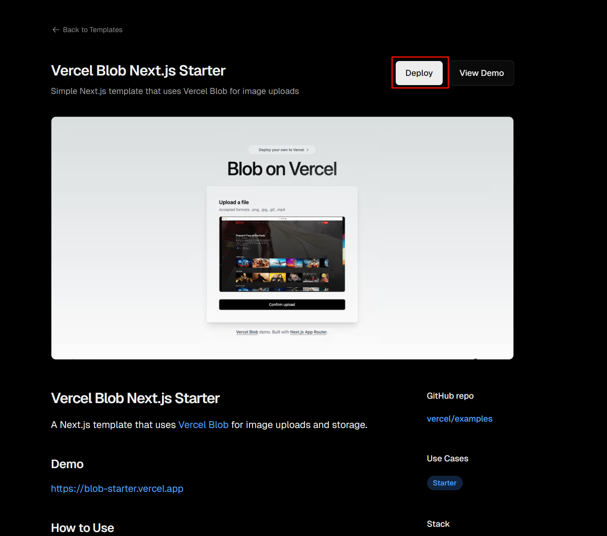
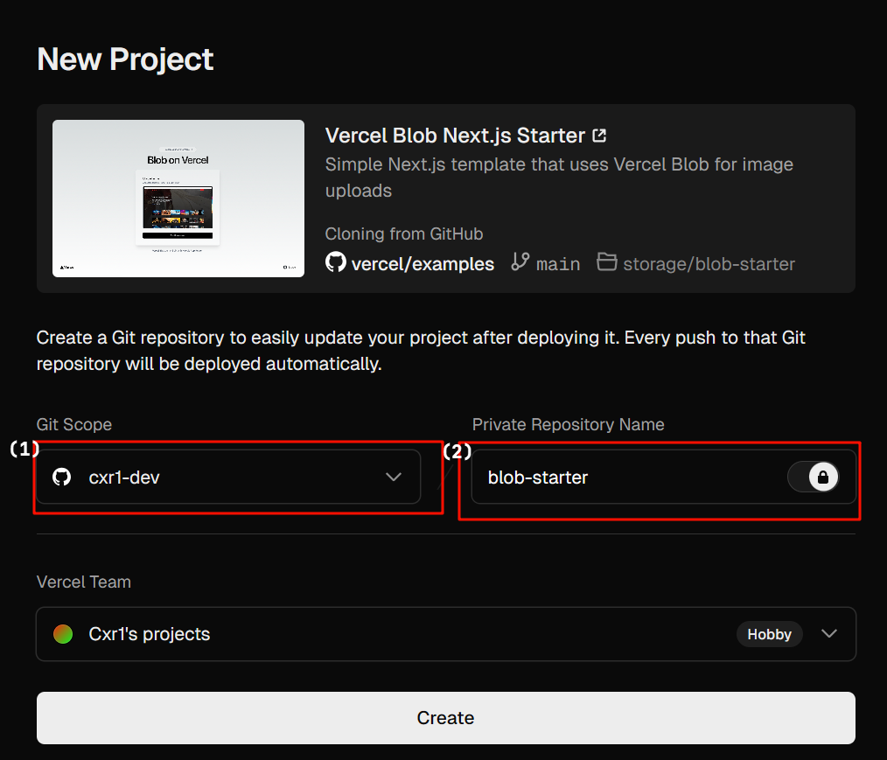
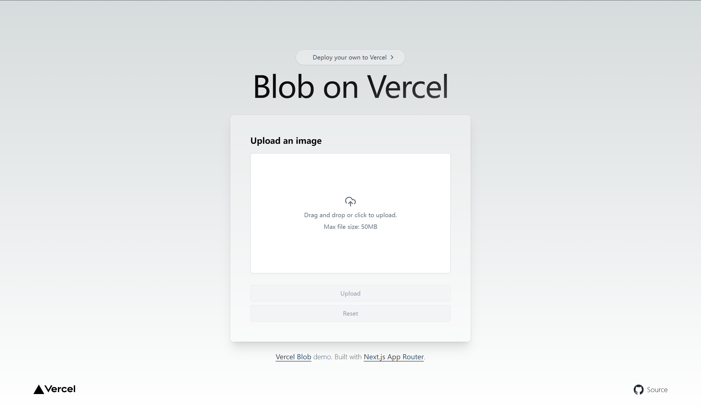
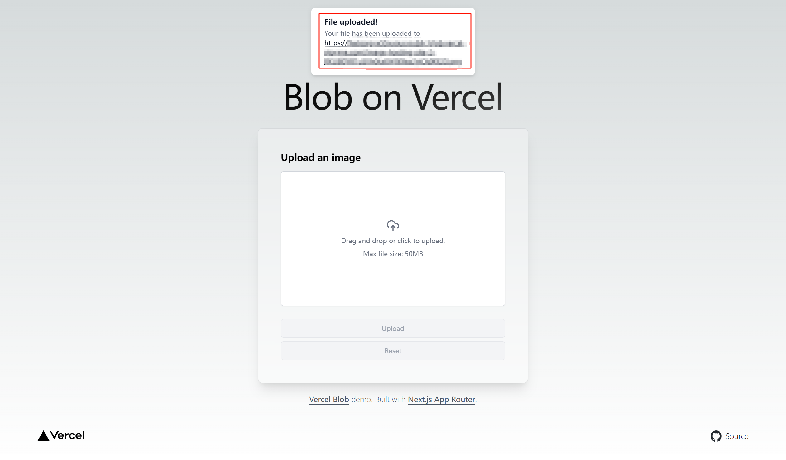

# -1.引言
我一直在为图床发愁，因为我的博客总是缺少一些图片，但是今天我发现了一个有Vercel就能部署的图床。
# 0.准备工作
你需要准备的东西：
- 一个阅读理解较好的脑子（至少需要2个线程）
- 一个能运行3+网页的现代`PC`/`Mac`
- 一个`Vercel`账号
- 一个`Github`账号
# 1.正式开始
首先访问：https://vercel.com/new/users-projects/templates/next.js/blob-starter
###### PS：将users-projects中的user替换成你的vercel名

接下来点击`Deploy`

接下来选择好`Git Scope`，填写`Public/Private Repository Name`，按自己需要选择`Private`/`Public`，最后单击`Create`创建。

创建完成后按需绑定域名或执行其他操作，接下来访问你的网址，如下图：
接下来将图片丢入/点击按钮选择图片，点击`Upload`

等待进度条跑完，会弹出：

就可以通过这个`URL`访问你的图片了。
# 2.结语
`Vercel`不仅可以部署`Fuwari`等静态网站框架，也可以做这种图床应用，人类对于`Vercel`的开发不足`1%`。
