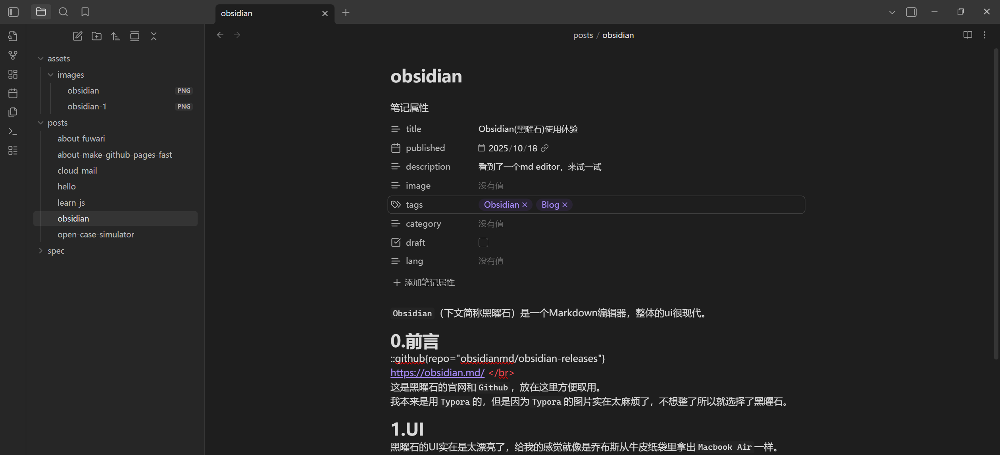
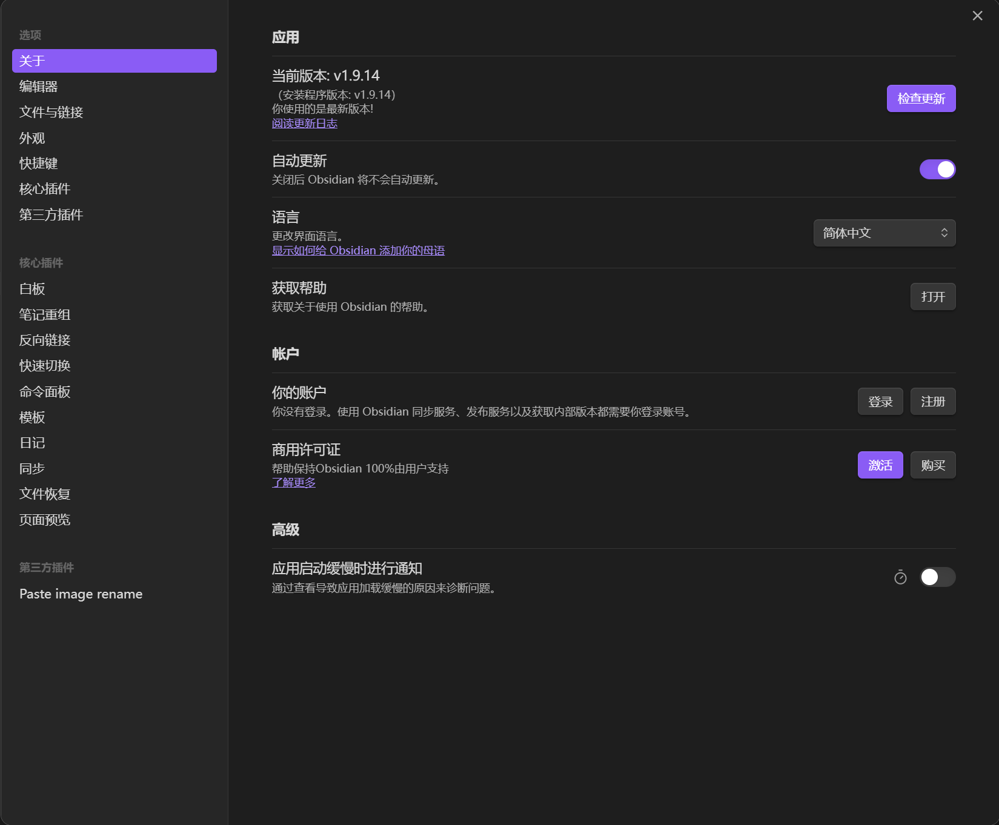
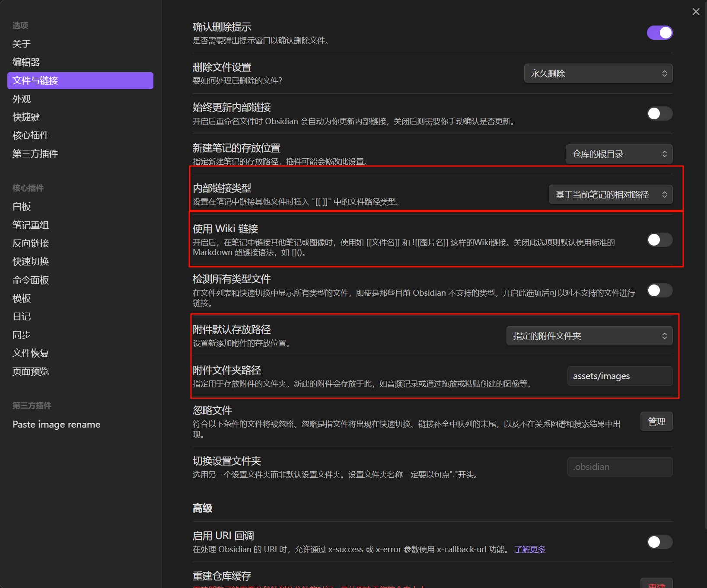
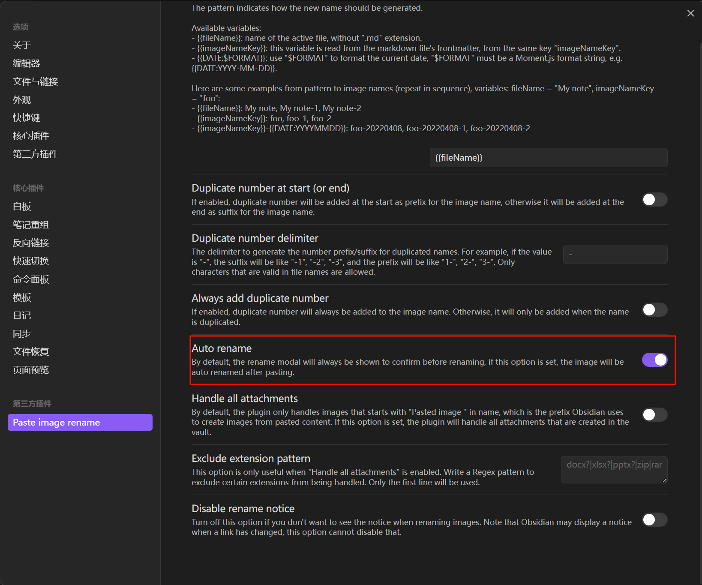

`Obsidian`（下文简称黑曜石）是一个Markdown编辑器，整体的ui很现代。
# 0.前言
::github{repo="obsidianmd/obsidian-releases"}
https://obsidian.md/  
这是黑曜石的官网和`Github`，放在这里方便取用。
我本来是用`Typora`的，但是因为`Typora`的图片实在太麻烦了，不想整了所以就选择了黑曜石。
# 1.UI
黑曜石的UI实在是太漂亮了，给我的感觉就像是乔布斯从牛皮纸袋里拿出`Macbook Air`一样。

主页面

设置

先相比于`Typora`，黑曜石处处透露着现代，而`Typora`则像是`Windows1.0`那种古老。
综合评价（5⭐制）：⭐⭐⭐⭐⭐
# 2.功能
黑曜石有着丰富的插件（`Plugins`），所以使用体验也很不错，我目前安装了`Paste image rename`这个插件，在黑曜石的设置里有关于图像复制的路径的设置，所以搭配上这个插件设置中的`Auto rename`功能就可以很方便的插入图片。

综合评价（5⭐制）：⭐⭐⭐⭐⭐
# 3.总结
我非常推荐这个`Markdown`编辑器，现代化、美观、优雅是我对它的第一印象，也给了我很好的使用体验，本篇文章也是在`Obsidian`中完成的。
