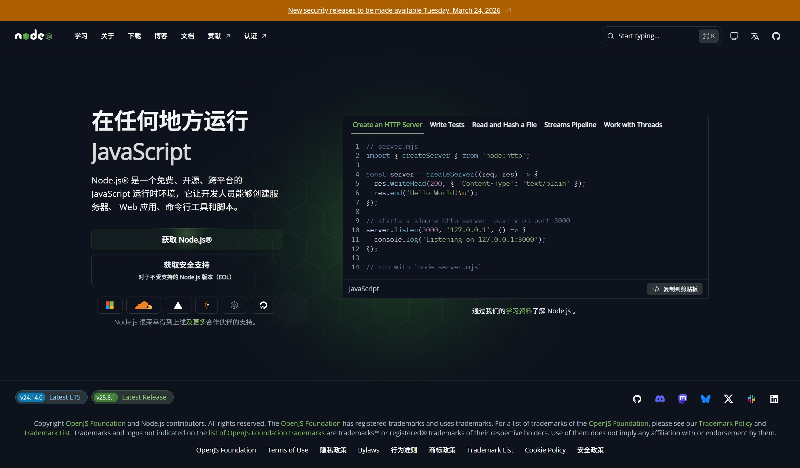
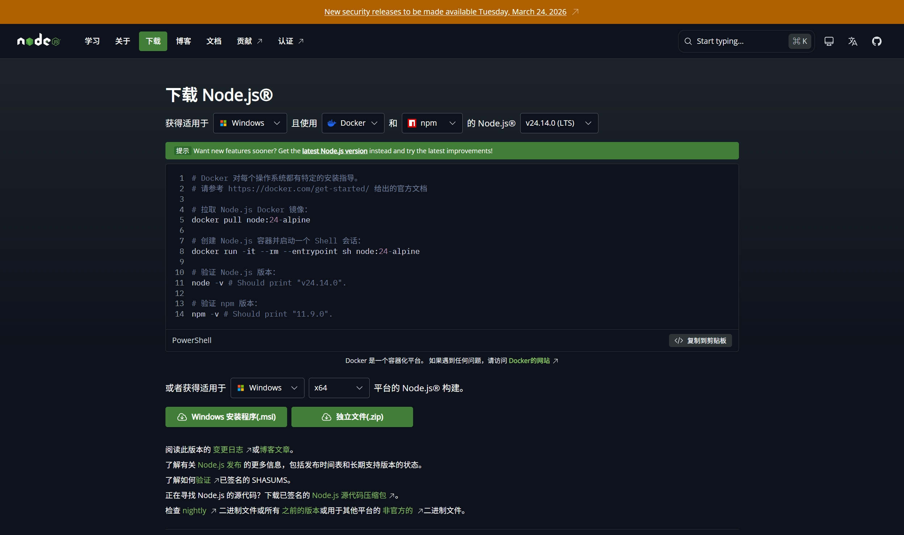
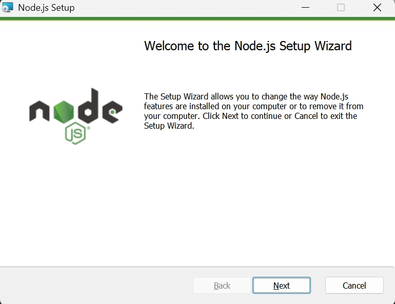
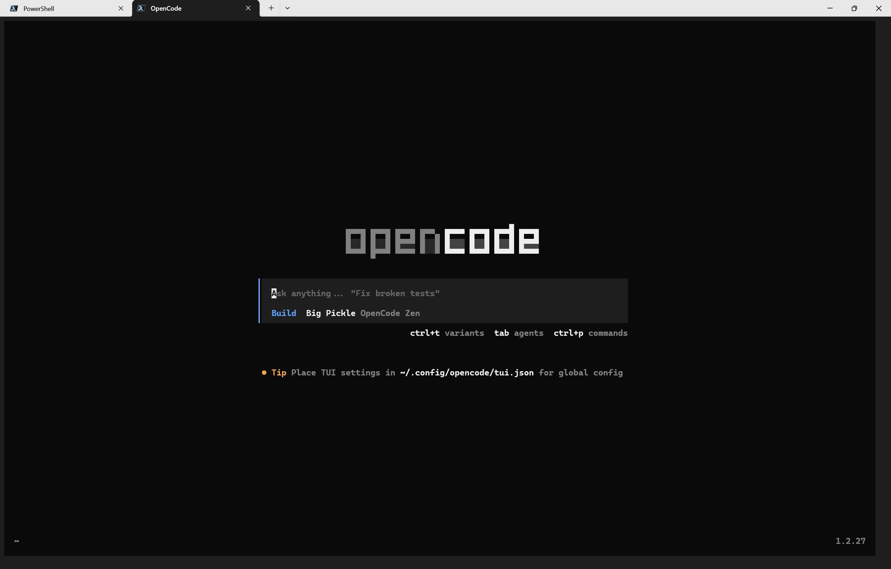

> 这两天在一只猫的推荐下尝试了OpenCode（以下简称OC），说实话我平常是对这些Agent不感兴趣也持怀疑态度的，那只猫也是这样，但他安装了OC，并给我展示了OC诸多的功能，我惊叹于它惊人的效率和质量，我敢说比我干的质量和效率都是碾压，所以我决定安装上体验一下。
# 0.准备工作
为了让你在阅读后面不会犯懵，请你确保你有如下能力：
- 一台能**正常上网**能打开2+网页的Win10/11 PC
- 一个可以正常工作的脑子
- 会打字的手
- 小学以上的英语水平和理解能力
# 1.安装`Node.js`
访问[Node.js官网](https://nodejs.org/zh-cn)：

点击「获取`Node.js`」：

点击「`Windows`安装程序(.msi)」，等待下载完成。
完成后打开安装程序：


根据指示安装。
## 2.安装`OpenCode`
打开`终端`（最好是最新版的`Powershell`），输入如下命令：
```bash
npm i -g opencode-ai
```
好了，**安装完了！**
# 3.运行并测试
在终端输入```
```bash
opencode
```
后等待直至显示如下界面：

ok，接下来可以问它几个问题，也可以让它帮你处理文件。
# 4.尾声
关于安装`MCP`的部分我并没有提到，因为我对这方面不了解，你可以让它自己帮你装它的`MCP`（因为我就是这么干的）。  
如果出现报错可以在这篇文章下面留言，我会竭尽所能帮你解决，我解决不了你就和ai高谈论阔去吧。  
这篇文章就到这里了，再见！
<script src="https://giscus.app/client.js"
        data-repo="cxr1-dev/giscus-fuwari"
        data-repo-id="R_kgDOPYpcxQ"
        data-category="Announcements"
        data-category-id="DIC_kwDOPYpcxc4CtzPu"
        data-mapping="pathname"
        data-strict="0"
        data-reactions-enabled="1"
        data-emit-metadata="0"
        data-input-position="top"
        data-theme="dark"
        data-lang="zh-CN"
        data-loading="lazy"
        crossorigin="anonymous"
        async>
</script>